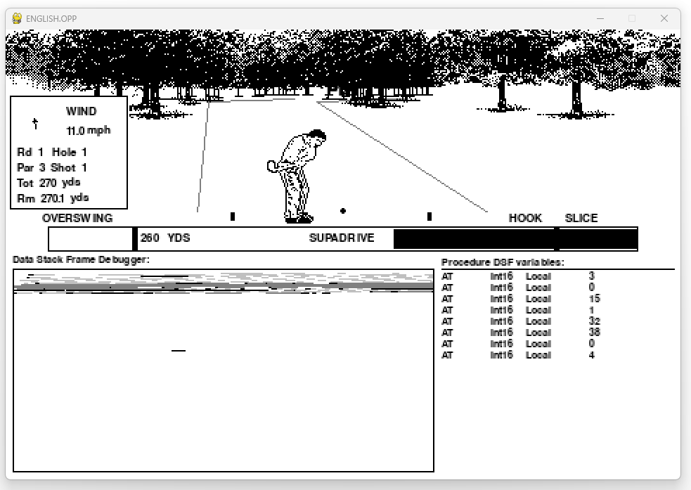
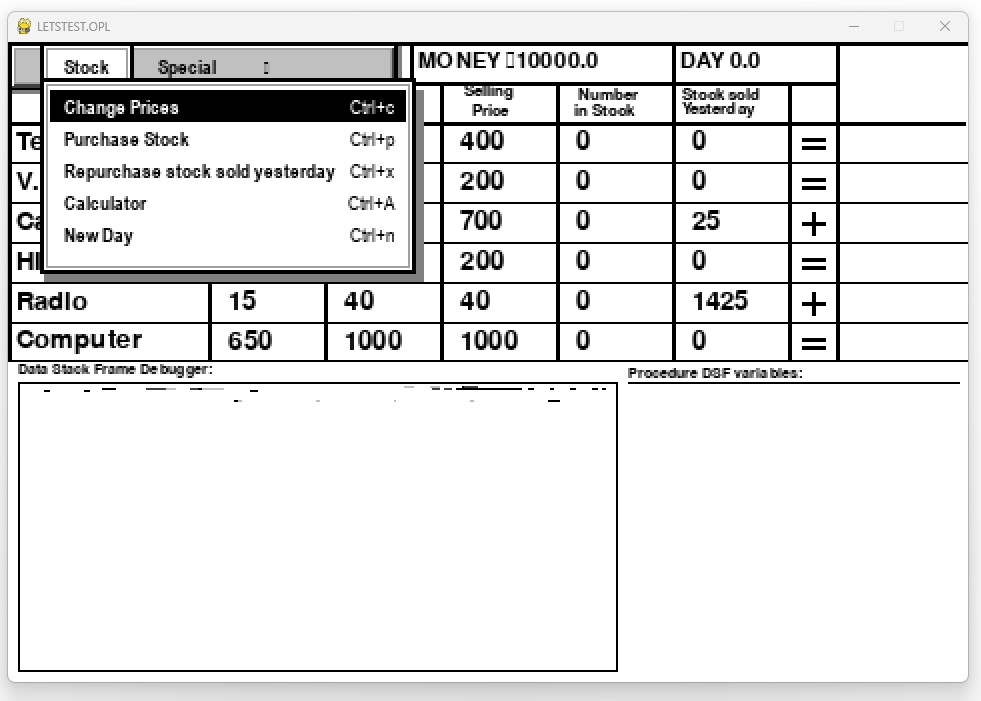
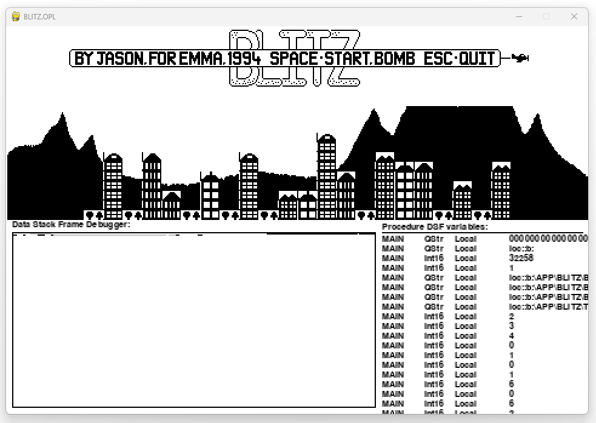
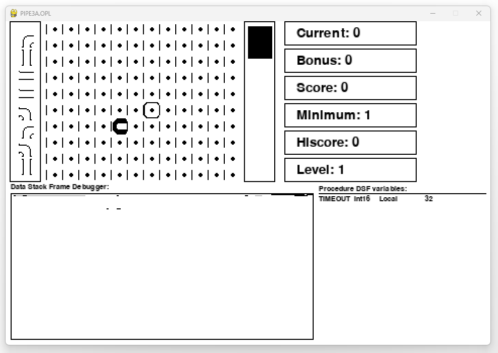

# PyOpo
SIBO/EPOC Compiled OPL interpreter written in Python

Supported features:

* Filesystem abstraction and support for various EPOC/SIBO file types (DBF, SPR)
* Multi-module support via LOADM
* A range of common system calls (CALL & OS) are emulated
* Most graphical operations and modes are supported (limited inverted drawing is supported at a slower render speed)
* Emulation of standard SIBO menus and Dialogs

## Screenshots

Example code and applications downloaded from the internet, running in the PyOpo interpreter. Some feature the attached Debugger tooling:

## Implementation notes

Understanding of some functionality in the OPL runtime has been gleamed by the following sources:

* PSIONICs and RevTran derived qcode.txt
* OpoLua
* opl-dev

Without an operational PSION or emulated environment, verification of opcode edge cases via test is not possible.

This interpreter can only execute pure OPL derived OpCodes, extended interop into ARM via USR calls is not currently emulated, nor likely will be.

The interpreter is currently configured to support SIBO instructions and behaviour, EPOC behaviour is possible however it requires manual alterations.

Over and underflow errors are not currently checked at runtime by the interpreter.

The interpreter utilises a dynamic heap containing data frames, however the debugger stores a lookup dictionary of offset locations and variable metadata. This was done as they are solving different problems. The debugger does not verify or store information about memory allocation operations.

Currently global locations are not reserved in the heap, and are only 'pinned' to the first active procedure that declared it. If that procedure has returned, the reference to the global is lost. It is unknown (untested) whether this is expected behaviour

## Missing or incomplete features

* (Missing) Ability to load specific formats - .WVE
* (Missing) Audio functionality - System calls are stubs
* (Incomplete) Invert drawing mode
* (Incomplete) Database functionality
* (Missing) USR calls
* (Incomplete) CALL and OS functionality
* (Incomplete) DIALOG functionality (dTIME, dFILE)
* (Missing) Most extended 0xFF OpCodes
* (Missing) EPOC Colour support
* (Missing) Toolbar support

## References

## Licensing

PyOpo is licensed under the MIT License (see [LICENSE](LICENSE)).